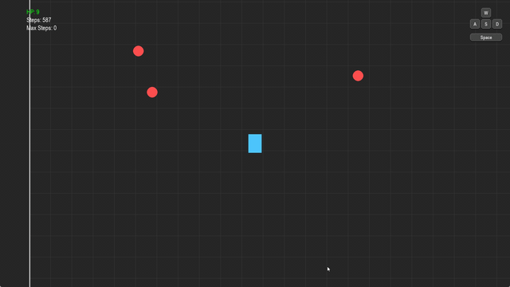
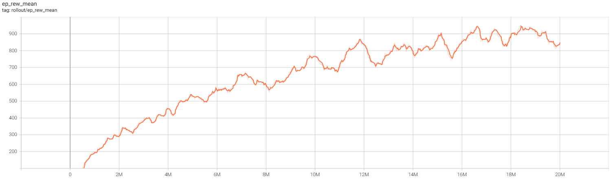
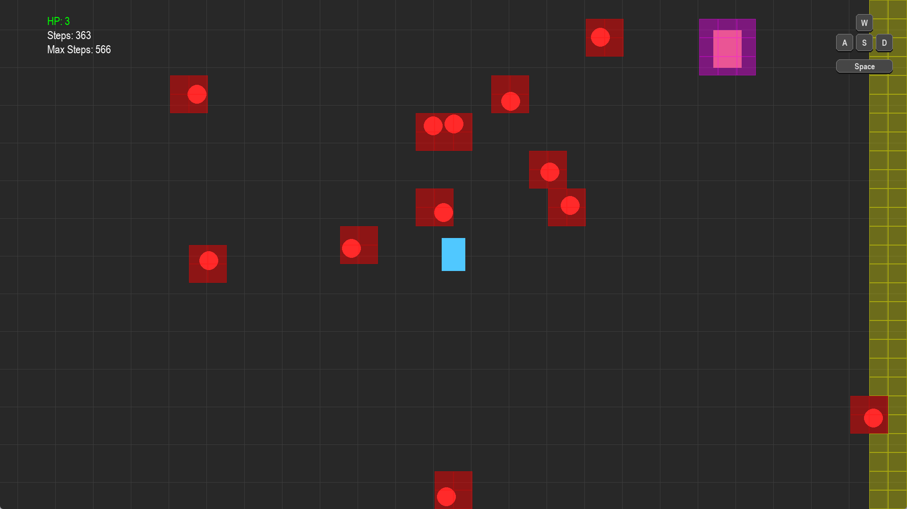

[English](#english) | [中文](#中文)

## English

A 2D bullet-dodge reinforcement learning environment built on `pygame` and `gymnasium`. Provides a standard RL interface with support for PPO training, model inference, and manual play.

This environment was originally designed for training an AI to play *Enter the Gungeon*. The game scene, observation space, and other aspects aim to replicate how the real game conveys information — using YOLO to detect bullets and enemies on screen, then mapping the detection results into a grid observation. In practice, YOLO's object detection speed proved too slow for the AI to react in time during real gameplay, so the overall results were mediocre. However, this simulated environment remains a complete and useful testbed for bullet-dodge RL training.



### Project Structure

```text
bullet-dodge-rl/
  bullet_dodge_env/
    __init__.py
    env.py          # Game simulator & BulletEnv
    callbacks.py    # Stable-Baselines3 callbacks
    utils.py        # Math utilities & learning rate scheduler
  cnn.py            # CNN feature extractor
  models/
    example_model.zip  # Trained PPO model
  logs/
    example/           # Example training logs
  media/
    play.mp4        # AI gameplay demo
    obs_grid.png    # Observation space screenshot
    reward.png      # Reward curve
  play.py           # Manual play
  predict.py        # Run model inference
  train.py          # PPO training entry point
  pyproject.toml
  requirements.txt
  README.md
  LICENSE
  .gitignore
```

### Installation

```bash
# Create virtual environment
python -m venv .venv
.venv\Scripts\activate

# Install dependencies
pip install -r requirements.txt
```

### Manual Play

```bash
python play.py
```

Control your character in a 2400×2400 world, dodging bullets and enemies. Taking damage reduces HP; reaching zero HP triggers auto-respawn.

| Key | Action |
| --- | --- |
| W/A/S/D | Move (supports 8-directional combinations) |
| Space | Dash (brief invincibility + speed boost) |

### Running the Example Model

```bash
python predict.py
```

| Argument | Default | Description |
| --- | --- | --- |
| `--model` | `models/example_model.zip` | Model file path |
| `--steps` | `100000` | Number of steps to run |

### Training

```bash
# Train from scratch
python train.py --total-steps 5000000

# Resume from a checkpoint
python train.py --resume models/example_model.zip --total-steps 10000000
```

| Argument | Default | Description |
| --- | --- | --- |
| `--total-steps` | `5000000` | Total training steps |
| `--checkpoint-freq` | `200000` | Checkpoint save interval |
| `--log-dir` | `logs` | TensorBoard log directory |
| `--resume` | None | Resume from an existing model |

Training uses a CNN feature extractor (`cnn.CustomCombinedExtractor`) by default. The learning rate linearly decays from `3e-4` to `3e-5` over the first 500k steps.

When using `--resume`, the model architecture and optimizer state are restored from the checkpoint, and the step counter continues from where it left off — it does not reset.

Training logs are written to `logs/` and can be viewed with TensorBoard:

```bash
tensorboard --logdir logs
```

Checkpoints are saved under `logs/<run>/checkpoints/` every `--checkpoint-freq` steps.



### Environment Details

#### Basic Settings

World size is 2400×2400, with a 1920×1080 viewport. The camera follows the player, keeping them centered. The game runs at 60 FPS, and each environment step executes 6 frames of game logic.

| Variable | Value | Description |
| --- | --- | --- |
| `WORLD_W`, `WORLD_H` | 2400×2400 | Player movement area |
| `SCREEN_W`, `SCREEN_H` | 1920×1080 | Display area |
| `FPS` | 60 | Game logic update rate |

#### Player

| Variable | Value | Description |
| --- | --- | --- |
| `PLAYER_HP` | 10 | Episode ends when HP reaches zero |
| `PLAYER_SPEED` | 400 px/s | Normal movement speed |
| `PLAYER_W`, `PLAYER_H` | 50×70 px | Collision hitbox |
| `DASH_SPEED_MULT` | 1.2× | Movement speed multiplier during dash |
| `DASH_DURATION` | 0.6 s | Dash high-speed phase |
| `DASH_RECOVERY_DURATION` | 0.1 s | Dash deceleration recovery phase |
| `DASH_RECOVERY_SPEED` | 0.5× | Speed multiplier during recovery |
| `DASH_COOLDOWN` | 1.0 s | Cooldown between dashes |
| `HIT_INVINCIBLE_DURATION` | 0 s | Invincibility frames after being hit |

#### Bullets

Bullets spawn randomly from screen edges, roughly aimed at the player with some random offset. Enemies also fire bullets.

| Variable | Value | Description |
| --- | --- | --- |
| `BULLET_R` | 20 px | Collision radius |
| `BULLET_SPEED` | 550 px/s | Constant flight speed |
| `BULLET_SPAWN_RATE` | 2/s | Random bullet spawn rate |
| `BULLET_RANDOMNESS` | 5% | Direction randomness for random bullets |
| `ENEMY_SHOOT_SPREAD` | 15% | Direction randomness for enemy bullets |

#### Enemies

4 enemies exist on the map simultaneously, moving randomly and firing a bullet toward the player every 1.2 seconds. Contact with enemies also deals damage.

| Variable | Value | Description |
| --- | --- | --- |
| `ENEMY_COUNT` | 4 | Simultaneous enemy count |
| `ENEMY_W`, `ENEMY_H` | 60×80 px | Collision hitbox |
| `ENEMY_SPEED` | 120 px/s | Random movement speed |
| `ENEMY_SHOOT_CD` | 1.2 s | Firing interval |
| `ENEMY_DIR_CHANGE_PROB` | 1%/frame | Random direction change probability |

#### Action Space

```python
MultiDiscrete([9, 2])
```

The first dimension is movement direction, the second is dash.

| Value | Movement |
| --- | --- |
| 0 | Idle |
| 1 | Up |
| 2 | Down |
| 3 | Left |
| 4 | Right |
| 5 | Up-left |
| 6 | Up-right |
| 7 | Down-left |
| 8 | Down-right |

| Dash Value | Description |
| --- | --- |
| 0 | No dash |
| 1 | Dash |

#### Observation Space

```python
Box(0, 4, shape=(stack_size, GRID_H, GRID_W), dtype=np.float32)
```

The 1920×1080 viewport is divided into a 27×48 grid (`GRID_H=27`, `GRID_W=48`) with `CELL=40` pixels per cell. Each cell records a danger level (normalized to 0–1):

| Danger Level | Meaning |
| --- | --- |
| 0 | Safe |
| 0.25 | Near wall (within `SAFE_WALL_DIST=200`px) |
| 0.5 | Bullet zone |
| 0.75 | Enemy zone |

Default `stack_size=4` stacks 4 frames to preserve temporal information.



#### Reward Function

| Condition | Reward | Description |
| --- | --- | --- |
| Per step | `+0.1` | Base survival reward |
| Dash | `-0.5` | Penalty for each dash use |
| Near wall | `-(1-t)²` | `t = distance / SAFE_WALL_DIST`, heavier penalty the closer you are |
| Bullet distance | `-1.0 ~ +0.1` | `-1.0` within `BULLET_R`, `+0.1` beyond `5×BULLET_R`, smooth transition in between |
| Taking damage | `-5.0` | Hit by bullet or enemy |

#### Termination Conditions

- Player HP ≤ 0 ends the episode
- `max_episode_steps` can be used to cap episode length

### Environment API

```python
from bullet_dodge_env.env import BulletEnv, Game

# Training (no rendering)
env = BulletEnv(render_enabled=False, stack_size=4)

# Manual play
game = Game(render_enabled=True, debug_obs=False)
game.play()

# Custom configuration
env = BulletEnv(
    render_enabled=False,    # Enable pygame rendering
    debug_obs=False,         # Visualize observation grid
    stack_size=4,            # Observation frame stack
    max_episode_steps=1000,  # Max steps per episode
)
```

### License

MIT License — see [LICENSE](LICENSE) for details.

---

## 中文

基于 `pygame` 和 `gymnasium` 的 2D 弹幕躲避强化学习环境。提供标准 RL 接口，支持 PPO 训练、模型预测和手动游玩。

本环境最初是为训练《挺进地牢》AI 而设计的，游戏场景、观测空间等方面都尽可能还原了真实游戏中的信息获取方式——通过 YOLO 检测屏幕上的子弹和敌人，将检测结果映射到网格观测中。实际运行时，由于 YOLO 的目标检测速度较慢，导致 AI 在真实游戏中的反应不够及时，最终效果一般，但这个模拟环境本身作为弹幕躲避的 RL 训练测试仍然是完整的。


### 项目结构

```text
bullet-dodge-rl/
  bullet_dodge_env/
    __init__.py
    env.py          # 游戏模拟器与 BulletEnv
    callbacks.py    # Stable-Baselines3 回调
    utils.py        # 数学工具与学习率调度
  cnn.py            # CNN 特征提取器
  models/
    example_model.zip  # 训练好的 PPO 模型
  logs/
    example/           # 示例训练日志
  media/
    play.mp4        # AI 游玩演示
    obs_grid.png    # 观测空间截图
    reward.png      # 奖励曲线
  play.py           # 手动游玩
  predict.py        # 运行模型预测
  train.py          # PPO 训练入口
  pyproject.toml
  requirements.txt
  README.md
  LICENSE
  .gitignore
```

### 安装

```bash
# 创建虚拟环境
python -m venv .venv
.venv\Scripts\activate

# 安装依赖
pip install -r requirements.txt
```

### 手动游玩

```bash
python play.py
```

操控角色在 2400×2400 的世界中躲避子弹和敌人。被击中扣血，血量归零后自动复活。

| 按键 | 动作 |
| --- | --- |
| W/A/S/D | 移动（支持八方向组合） |
| 空格 | 冲刺（短暂无敌 + 加速） |

### 运行示例模型

```bash
python predict.py
```

| 参数 | 默认值 | 说明 |
| --- | --- | --- |
| `--model` | `models/example_model.zip` | 模型文件路径 |
| `--steps` | `100000` | 运行步数 |

### 训练

```bash
# 从头训练
python train.py --total-steps 5000000

# 从已有模型继续训练
python train.py --resume models/example_model.zip --total-steps 10000000
```

| 参数 | 默认值 | 说明 |
| --- | --- | --- |
| `--total-steps` | `5000000` | 总训练步数 |
| `--checkpoint-freq` | `200000` | 检查点保存间隔 |
| `--log-dir` | `logs` | TensorBoard 日志目录 |
| `--resume` | 无 | 从已有模型继续训练 |

训练默认使用 CNN 特征提取器（`cnn.CustomCombinedExtractor`），学习率从 `3e-4` 线性衰减到 `3e-5`（前 50 万步）。

使用 `--resume` 时，模型结构和优化器状态从检查点恢复，步数计数器不重置，接着之前的步数继续训练。

训练日志写入 `logs/`，可用 TensorBoard 查看：

```bash
tensorboard --logdir logs
```

检查点保存在 `logs/<run>/checkpoints/` 下，每 `--checkpoint-freq` 步保存一次。


### 环境详解

#### 基础设定

世界大小 2400×2400，画面显示区域 1920×1080，摄像机始终跟随玩家居中。帧率 60 FPS，环境每步执行 6 帧游戏逻辑。

| 变量 | 值 | 说明 |
| --- | --- | --- |
| `WORLD_W`, `WORLD_H` | 2400×2400 | 玩家活动范围 |
| `SCREEN_W`, `SCREEN_H` | 1920×1080 | 显示区域 |
| `FPS` | 60 | 游戏逻辑更新频率 |

#### 玩家

| 变量 | 值 | 说明 |
| --- | --- | --- |
| `PLAYER_HP` | 10 | 归零则回合结束 |
| `PLAYER_SPEED` | 400 px/s | 普通移动 |
| `PLAYER_W`, `PLAYER_H` | 50×70 px | 碰撞判定矩形 |
| `DASH_SPEED_MULT` | 1.2× | 冲刺期间移动速度倍率 |
| `DASH_DURATION` | 0.6 s | 冲刺高速阶段 |
| `DASH_RECOVERY_DURATION` | 0.1 s | 冲刺减速恢复阶段 |
| `DASH_RECOVERY_SPEED` | 0.5× | 减速阶段速度倍率 |
| `DASH_COOLDOWN` | 1.0 s | 两次冲刺间隔 |
| `HIT_INVINCIBLE_DURATION` | 0 s | 被击中后无敌时间 |

#### 子弹

子弹从屏幕边缘随机生成，方向大致指向玩家，带一定随机偏移。敌人也会发射子弹。

| 变量 | 值 | 说明 |
| --- | --- | --- |
| `BULLET_R` | 20 px | 碰撞判定 |
| `BULLET_SPEED` | 550 px/s | 匀速飞行 |
| `BULLET_SPAWN_RATE` | 2/s | 随机子弹生成速率 |
| `BULLET_RANDOMNESS` | 5% | 随机子弹方向扰动 |
| `ENEMY_SHOOT_SPREAD` | 15% | 敌人子弹方向扰动 |

#### 敌人

地图上同时存在 4 个敌人，随机移动，每 1.2 秒发射一颗指向玩家的子弹。接触敌人也会受伤。

| 变量 | 值 | 说明 |
| --- | --- | --- |
| `ENEMY_COUNT` | 4 | 同时存在 |
| `ENEMY_W`, `ENEMY_H` | 60×80 px | 碰撞判定 |
| `ENEMY_SPEED` | 120 px/s | 随机方向移动 |
| `ENEMY_SHOOT_CD` | 1.2 s | 射击间隔 |
| `ENEMY_DIR_CHANGE_PROB` | 1%/帧 | 随机改变方向 |

#### 动作空间

```python
MultiDiscrete([9, 2])
```

第一维为移动方向，第二维为是否冲刺。

| 值 | 移动 |
| --- | --- |
| 0 | 静止 |
| 1 | 上 |
| 2 | 下 |
| 3 | 左 |
| 4 | 右 |
| 5 | 左上 |
| 6 | 右上 |
| 7 | 左下 |
| 8 | 右下 |

| 冲刺值 | 说明 |
| --- | --- |
| 0 | 不冲刺 |
| 1 | 冲刺 |

#### 观测空间

```python
Box(0, 4, shape=(stack_size, GRID_H, GRID_W), dtype=np.float32)
```

将 1920×1080 的画面以 `CELL=40` 划分为 27×48 的网格（`GRID_H=27`, `GRID_W=48`），每个格子记录危险等级（归一化到 0~1）：

| 危险等级 | 含义 |
| --- | --- |
| 0 | 安全 |
| 0.25 | 靠近墙壁（`SAFE_WALL_DIST=200`px 内） |
| 0.5 | 子弹区域 |
| 0.75 | 敌人区域 |

默认 `stack_size=4`，堆叠 4 帧以保留时序信息。


#### 奖励函数

| 条件 | 奖励 | 说明 |
| --- | --- | --- |
| 每步 | `+0.1` | 基础存活奖励 |
| 冲刺 | `-0.5` | 每次使用冲刺惩罚 |
| 靠近墙壁 | `-(1-t)²` | `t = 距离 / SAFE_WALL_DIST`，越近惩罚越大 |
| 子弹距离 | `-1.0 ~ +0.1` | `BULLET_R` 内 `-1.0`，`5×BULLET_R` 外 `+0.1`，中间平滑过渡 |
| 受伤 | `-5.0` | 被子弹或敌人击中 |

#### 终止条件

- 玩家血量 ≤ 0，回合终止
- 支持 `max_episode_steps` 限制最大步数

### 环境 API

```python
from bullet_dodge_env.env import BulletEnv, Game

# 训练用（无渲染）
env = BulletEnv(render_enabled=False, stack_size=4)

# 手动游玩
game = Game(render_enabled=True, debug_obs=False)
game.play()

# 自定义
env = BulletEnv(
    render_enabled=False,    # 是否开启 pygame 渲染
    debug_obs=False,         # 是否可视化观测网格
    stack_size=4,            # 观测堆叠帧数
    max_episode_steps=1000,  # 最大步数限制
)
```

### 许可证

MIT License — 详见 [LICENSE](LICENSE) 文件。